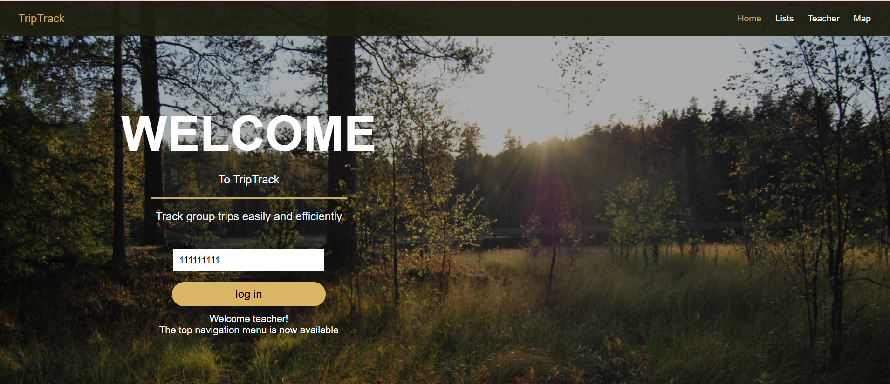
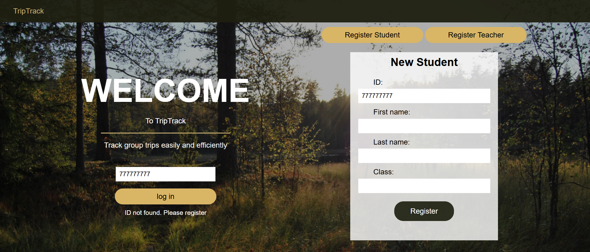
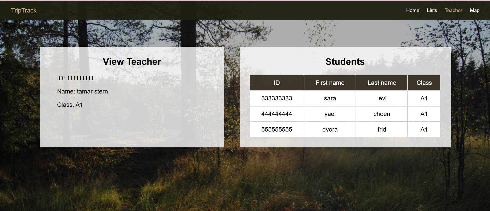
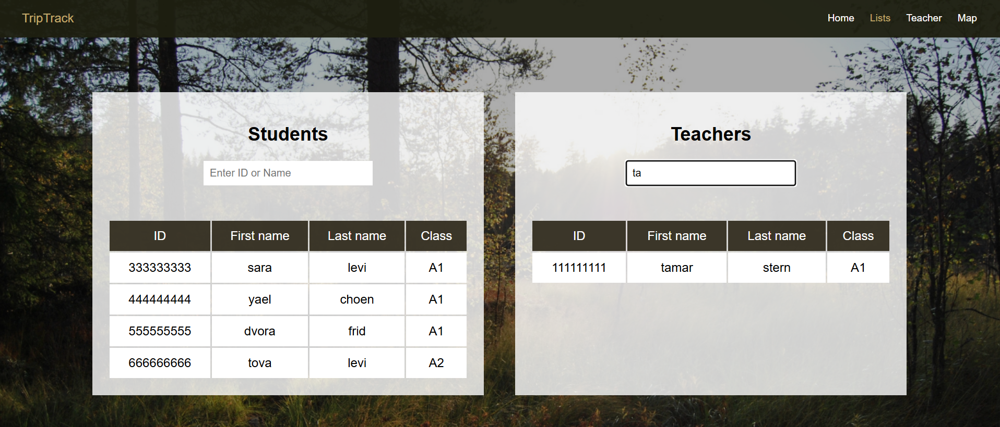
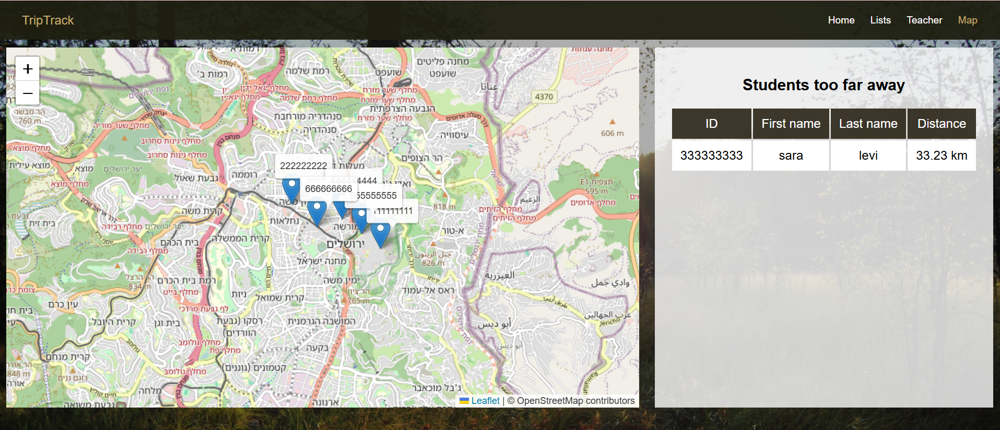

# Trip System

The system manages a school trip and allows teachers to track students' locations in real time.

---

## User Guide

#### Login and Identification
- **ID Entry:** Users enter their Identification Number in the "enter ID" field on the Home page and click "log in".
- **Automatic Routing:**
 * **Teachers:** If the ID is recognized as a teacher, the top navigation menu is revealed, and a welcome message appears.
 * **Students:** If the ID is recognized as a student, the system automatically redirects them to their personal dashboard.
 * **New User Registration:** If the ID is not found in the database, the registration form automatically appears on the side of the screen. The user can select their registration type (Student/Teacher), fill in their details, and join the system.
 
 

#### Teacher Interface & Class Management
- **Personal Profile:** By clicking the "Teacher" tab, teachers can view their personal details and their assigned class.


#### Lists and Search Functionality
- **Database Overview:** On the Lists page, authorized teachers can view all teachers and students registered in the system.
- **Advanced Search & Retrieval:**
 * Users can type an ID or a Name (first or last) into the search bar above each table.
 * The tables update in real-time, showing only the records that start with the entered characters.


#### Real-Time Map Tracking
- **Interactive Map:** On the Map page, teachers can view an interactive map with markers indicating the current locations of students.
- **Live Updates:** The map automatically refreshes every 60 seconds to provide an up-to-date status of the group’s location in the field.
- **Distance Monitoring:** A dedicated section highlights students who are more than 3km away from the teacher, ensuring safety and group cohesion.


**TripTrack** is a system for managing and tracking group trips, designed for teachers and students. The system allows for user registration, participant list management, and real-time location tracking of students on a map.

---

## Setup & Dependencies

### External Dependencies
The system is built with **Python 3.8+** and requires the libraries listed in the `requirements.txt` file:
* **FastAPI & Uvicorn:** For backend logic and server management.
* **Leaflet.js:** A map library (loaded directly via CDN in the frontend).

### Installation & Running
1. **Install Dependencies**:
   Run the following command in your project terminal:
   ```bash
   pip install -r requirements.txt
   
2.  **Run the Backend**:
    Launch the FastAPI server:
    ```bash
    uvicorn main:app --reload
    ```
    The server will run at: `http://127.0.0.1:8000`.

3.  **Run the Frontend**:
    Once the server is running, open your browser and navigate to:
    **`http://127.0.0.1:8000/home`**

